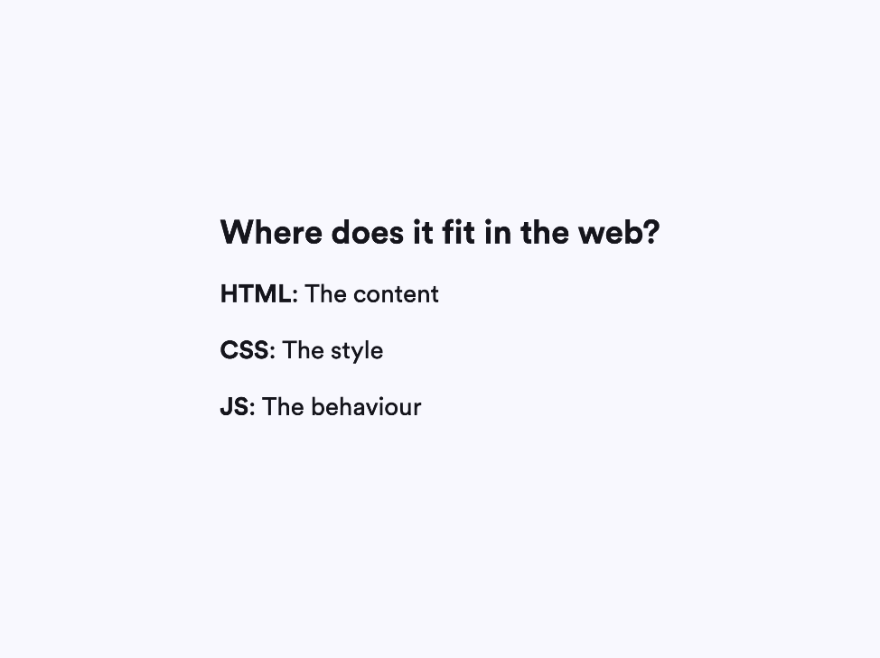
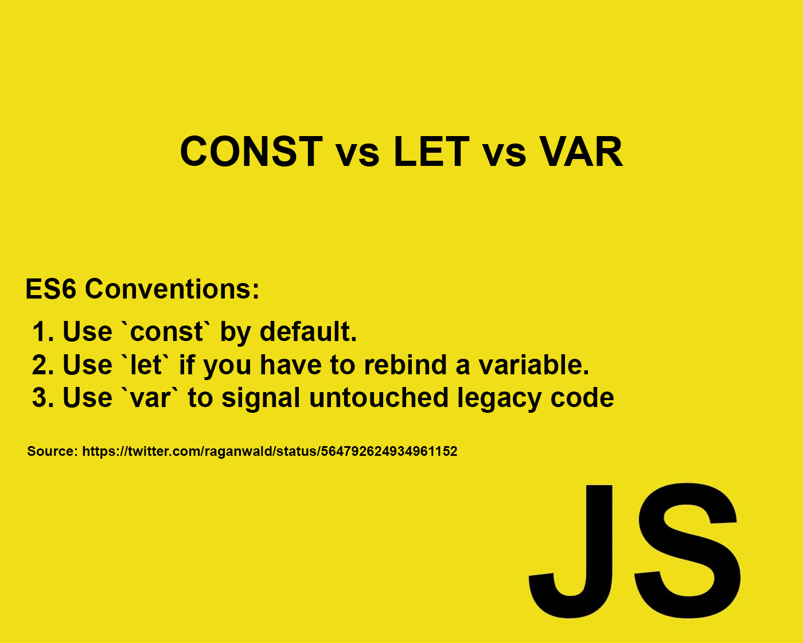
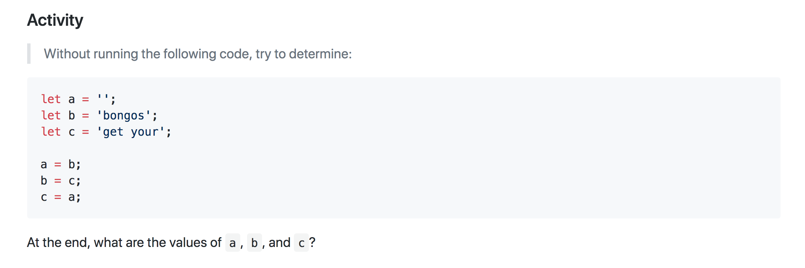

# Pseudocode Intro


# Javascript Intro


# JS Background & History





# Variables 





JavaScript Reserved Words: https://www.w3schools.com/js/js_reserved.asp


Note that I don't use let after the first line.
This is because the variable has already been declared.


## String Methods and Properties

```js
let name = "mike";
let capitalName = name.toUpperCase(); // ?

name.length // ?
```

## String Concatenation
```js

let firstName = "Mike";
let lastName = "Finneran";

let fullName = firstName + " " + lastName;
```

## Class activity
## My Future Cat
- Write a variable called `age`.
- Write a variable called `name`.
- Write a variable called `color`.
- Then write a variable  called `cat` and assign all the previous variables along with a sting concatenation.
- Then call the the variable `cat` with `console.log(cat)`.
- Result will be: `My future cat's name is Strawberry, he is 86 years old, and his color is Orange.`

## Calculate the area
To find the area of a rectangle multiply its height by its width.
A = H * W
Result will be : The area of rectangle is '40.20'

## Comparison Operator


## Logical operators


## Conditions


# Exercises: if/else if/else statements

## What number's bigger?

Write an if statement that tests two number (numOne and numTwo), and prints the biggest number

## Driving Age

- Store the user age
- If age is less than 18, print "Sorry, you can't drive yet"
- If the age is equal to or over 18, print "Drive away!"
- Bonus: If the user can't drive yet, tell them how many years they will have to wait. E.g. "Sorry, you have 4 years to wait until you can drive"

## [JavaScript-Equality-Table](https://dorey.github.io/JavaScript-Equality-Table/)





# Fizzbuzz

- Write a program that declares a variable equal to a number 0 - 100

- If it is a multiple of 3, print “Fizz” instead of the number.

- If it is a multiple of 5, print “Buzz” instead of the number.

- If it is a multiple of both 3 and 5, print “FizzBuzz” instead of the number.

- Otherwise, print the number


## Additional Resources

- https://javascript.info/
- https://www.codeanalogies.com/
